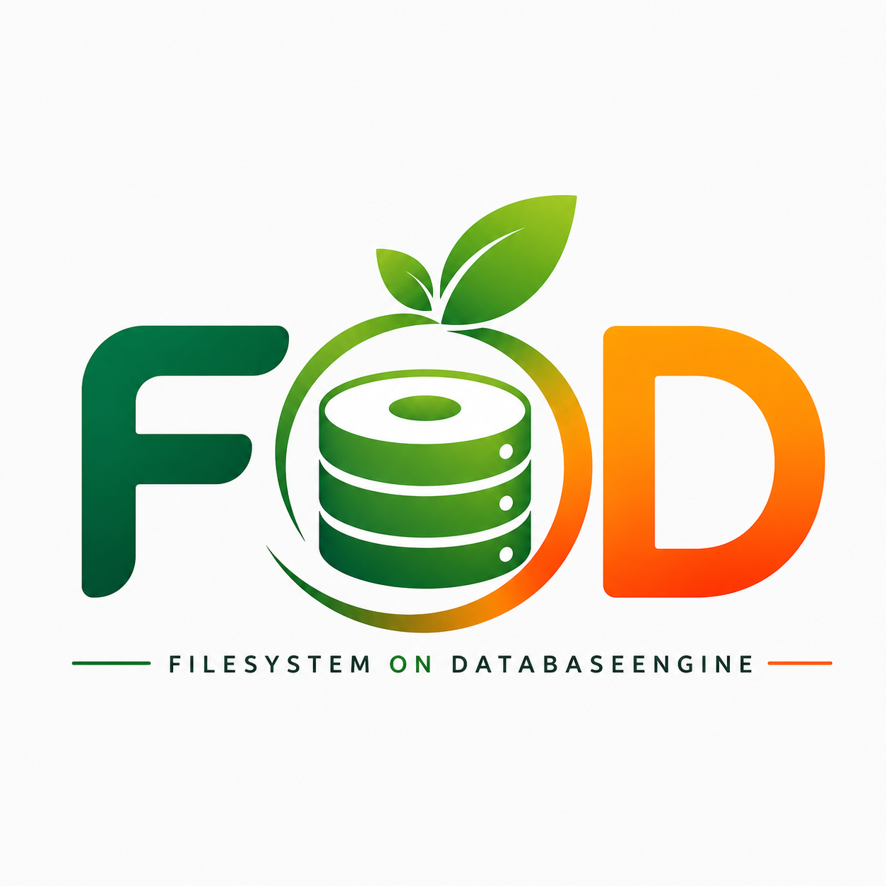

<p align="center">
  
</p>

# FOD

[](https://github.com/stachwk/fod/actions/workflows/ci.yml) [Roadmap](ROADMAP.md) [Benchmarks](BENCHMARKS.md)

FOD (Filesystem On DataBaseEngine) is a PostgreSQL-backed filesystem exposed through FUSE. It is designed to behave like a practical Linux filesystem, with predictable metadata, working directory semantics, advisory locking, ACL-aware access checks, and a test suite that exercises the hot paths end to end.

Keywords:
- filesystem
- FUSE
- PostgreSQL
- database-backed filesystem
- object storage
- file storage
- Rust
- Linux

Current runtime note: FOD is Rust-backed end to end. Any Python references below are historical migration baselines, not active runtime fallback paths.

## Overview

FOD, short for Filesystem On DataBaseEngine, is a filesystem that runs on top of PostgreSQL. The project is meant to make file storage inside a database easier to integrate into real applications.

Many applications need to store documents, images, backups, logs, or other binary data in a database. In practice that often forces teams to build and maintain extra application layers for:

- file upload and download
- directory management
- data synchronization
- version control
- replication handling
- read-only sharing
- backup and restore workflows

That increases application complexity and creates more code to own.

FOD is still an early-stage project, so APIs, benchmarks, and performance characteristics are still evolving. The goal right now is correctness, architecture, and practical filesystem behavior rather than claiming mature peak throughput.

FOD removes that burden by exposing a standard filesystem interface. For users and applications it behaves like a conventional filesystem such as ext4 or xfs.

Applications can use familiar operations like:

- `open`
- `read`
- `write`
- `mkdir`
- `rename`
- `cp`
- `rsync`
- `tar`

without needing to know that the data is stored physically in PostgreSQL.

### Main Benefits

- Simple integration: applications store files in the usual way, without custom binary-storage logic.
- Centralized data: files and metadata live in one consistent system managed by PostgreSQL.
- PostgreSQL features: FOD naturally benefits from streaming replication, standby/read-only replicas, backup and restore, Point In Time Recovery (PITR), transactions, integrity controls, and multi-location operation.
- Read scaling and replication: multiple read-only instances can run against PostgreSQL replicas, which makes it possible to build distributed file delivery systems, archives, and HA/DR environments.
- Transparency: users do not need to understand database schema details or learn special APIs.

### Typical Uses

- central document repositories
- backup systems
- log storage
- HA/DR systems
- read-only clusters
- data archiving
- shared storage for applications
- containers and cloud environments
- edge systems with local replicas

### Project Idea

FOD combines the convenience of a classic filesystem with the capabilities of a modern database engine.

Instead of building more intermediate layers for file handling, applications can use one consistent filesystem interface while PostgreSQL provides durability, consistency, replication, and data safety.

The project focuses on:

- stable filesystem metadata
- sensible Linux/VFS compatibility
- explicit runtime controls for SELinux, ACL, and atime policy
- integration tests that validate the real mount behavior, not just backend helpers

## Licensing

FOD is source-available software licensed under Business Source License 1.1 (BSL 1.1).

- Non-commercial use is allowed.
- Commercial usage requires a separate written agreement with the copyright holder.
- See [`LICENSE`](LICENSE) for the full license terms and [`LICENSE-COMMERCIAL`](LICENSE-COMMERCIAL) for commercial licensing contact details.

## Current Status

- Core FUSE operations are implemented and covered by integration tests.
- `make test-all` passes, and `make test-all-full` is available for wider coverage.
- Reads use block-range loading with a small read cache and read-ahead instead of loading whole files on every access.
- The permissions comparison test is intentionally local-filesystem-vs-FOD, not ext4-only; it compares the host's writable local filesystem against FOD and asserts matching semantics for mode, ownership, access checks, sticky-bit unlink/rmdir, and root-owned files.
- `allow_other` visibility is host-dependent: the dedicated test skips when the host does not expose the mount to `nobody`, so it is a diagnostic coverage check rather than a universal pass/fail guarantee.
- The runtime is Rust-backed end to end: the mount frontend lives in `rust_fuse`, schema/bootstrap live in `rust_mkfs`, indexing lives in `rust_indexer`, and the old Python runtime modules have been removed.
- Lookup, namespace CRUD, metadata, permissions, xattrs, locking, storage, and journal handling now live in Rust instead of in Python helper modules.
- The shared `fod-indexer` core now covers source registration, `scan`, `hash`, duplicate reporting, `plan-import`, `materialize`, and `cleanup-failed` through one source-capability model. Current source kinds stay path-backed, mirrored, or export-backed (`local`, `smb`, `qnap`, `adb`, `github`), and `--name` remains an explicit override.
- For FUSE backend selection, `libfuse3` is the strategic baseline when compatibility, standardness, and easier upstream-aligned debugging matter most; other stacks are kept for comparisons, prototypes, and diagnostics.
- Metadata caching is now explicitly split between attribute cache and directory-entry cache instead of using one shared payload shape for both.
- SELinux is xattr-backed with runtime gating; full mount-label policy is intentionally out of scope.
- PostgreSQL TLS is optional and config-driven; FOD can also generate a local client cert/key pair when requested.
- Transient PostgreSQL disconnects in the read/write hot path are retried once with state preserved in the client process, so in-flight dirty write state and read caches can survive a reconnect attempt.
- PostgreSQL-backed leases are the production lock path for both `flock` and `fcntl` range locks, with TTL and heartbeat. Writable primary mounts also keep a `client_sessions` row that is heartbeated alongside the local owner keys they touch, so the DB can tell when a mount is still alive. `make test-locking` remains the lock-semantics suite, `make test-pg-lock-manager` covers the production PostgreSQL-backed backend, and `rust_fuse/tests/lock_backend_smoke.rs` now checks two independent primary mounts against the same database plus a replica that stays memory-backed.
- The Rust runtime keeps separate cached write and control-plane connections, so heartbeat and lease maintenance do not have to wait behind a long flush.
- Expired writable primary sessions are cleaned up by PostgreSQL itself: deleting a dead `client_sessions` row fires a trigger that reaps the session's lock leases and range leases by `session_id`.
- Fresh installs use `migrations/base_schema.sql`, while `migrations/` keeps the numbered upgrade path from older schema states and the explicit `mkfs.fod status` export.
- The current FOD version comes from the root Cargo workspace package version and is surfaced by the Rust `fod-config` helper; both `fod-bootstrap --version` and `mkfs.fod --version` print the same value. Cargo crate versions inherit that workspace version.
- The canonical FOD storage schema is `fod` on purpose: it keeps FOD tables out of `public` so other applications in the same database do not collide with FOD objects. In other words, `fod = canonical FOD storage schema`. A future `fod.schema_name` knob could support multiple FOD instances in one database, but the current runtime is intentionally fixed to `fod`.
- Performance work is merged, and the current benchmark baselines are recorded in `BENCHMARKS.md`.
- The Rust hot-path now lives in the Rust backend and shared hot-path library, covering the planner, changed-run packing, persist padding, read assembly, logical resize planning for `truncate()`/`fallocate()`, and the first repository lookups/mutations. Changed-copy dedupe stays opt-in because it can slow copy-heavy workloads down substantially.
- The local Docker Compose stack preloads `pg_stat_statements`, and `make enable-pg-stat-statements` can create the extension in the local database when the DB user has permission. That keeps query analysis and runtime profiling available in the local stack without making FOD init depend on extension privileges.
- `TODO.md` serves as a decisions-and-notes log rather than an active implementation backlog.

## CI Coverage

The GitHub Actions workflow runs a small compile job plus a curated test matrix:

| Job | What it does |
| --- | --- |
| `compile` | Byte-compiles the core modules and the current integration-test entry points. |
| `workflow runtime` | Forces JavaScript actions onto Node 24 ahead of the GitHub default switch. |
| `test-runtime-config` | Verifies runtime config parsing and resolved tuning values. |
| `test-runtime-validation` | Verifies invalid runtime tuning values fail fast. |
| `test-runtime-profile` | Verifies named runtime profiles. |
| `test-schema-upgrade` | Verifies non-destructive schema init, version repair, and schema-admin secret protection. |
| `test-schema-status` | Verifies schema status export and the documented migration manifest. |
| `test-postgresql-requirements` | Verifies the minimum PostgreSQL version and connection capacity. |
| `test-metadata-cache` | Verifies the short-TTL metadata and `statfs` cache behavior. |
| `test-pg-lock-manager` | Verifies the PostgreSQL-backed lock backend, TTL / heartbeat behavior, and the multi-host smoke coverage. |
| `test-read-ahead-sequence` | Verifies sequential read-ahead behavior. |
| `test-block-read` | Verifies block-range reads instead of whole-file reads. |
| `test-flush-release-profile` | Verifies flush/release profiling behavior. |

For step-by-step local verification profiles, see [zasady_sprawdzen.md](zasady_sprawdzen.md).

## Known Limits

- Full SELinux mount-label policy is intentionally out of scope; FOD keeps SELinux as xattr-backed metadata plus runtime gating.
- `ioctl` support currently covers `FIONREAD`, `FIGETBSZ`, `FS_IOC_GETFLAGS`, and `FS_IOC_FSGETXATTR`; `FS_IOC_SETFLAGS` and `FS_IOC_FSSETXATTR` accept only zero/no-op requests until a real flag policy is defined.
- `FICLONE` remains experimental and may still be blocked before userspace on some stacks, so reflinks are not a production promise yet.
- Special device node metadata is stored, but direct special-node execution semantics are still not a general-purpose focus.
- FOD is still early-stage, so APIs, benchmarks, and performance defaults may still evolve.
- `make test-all` is the main regression target; mount-heavy workflows are covered, but CI is still focused on a curated subset that is stable in automation.
- Schema upgrades are currently conservative: `init` applies the fresh-install base schema, `upgrade` repairs missing schema state and restores the current version, and the repo keeps the numbered migration files for older databases.
- FOD normalizes timestamps through a UTC PostgreSQL session and UTC-aware conversions in the Rust runtime so local timezone differences do not shift metadata. The UTC session setup is initialized once per physical pooled connection, not on every filesystem operation, and the database creation defaults are not relied on.
- Recovery is limited to retrying transient disconnects on the read/write hot path; FOD keeps in-memory dirty state and caches across reconnects, but it does not yet implement full replay of arbitrary in-flight SQL work and it only retries the bounded reconnect path.

## Requirements

- Rust toolchain (`cargo`)
- PostgreSQL
- FUSE support on the host
- `openssl` if you want FOD to auto-generate a PostgreSQL TLS client cert/key pair

## Rust Binaries

FOD is built and installed from the Rust crates. The main runtime commands are:

- `fod-bootstrap`
- `fod-config`
- `mkfs.fod`
- `mount.fod`

Additional Rust tooling includes `fod-indexer` for source registration, scanning, duplicate reporting, planning, materialization, and cleanup of external sources before import.

The installed `mount.fod` wrapper prefers `target/debug/fod-bootstrap` and `target/release/fod-bootstrap` from the current project checkout, then the legacy `rust_mkfs/target/debug/fod-bootstrap` and `rust_mkfs/target/release/fod-bootstrap` paths, then `fod-bootstrap` from `PATH` and `/usr/local/bin/fod-bootstrap`. The bootstrapper itself prefers `rust_fuse/target/debug/fod-rust-fuse`, then `fod-rust-fuse` from `PATH`, then `/usr/local/bin/fod-rust-fuse`. If `FOD_CONFIG` is not set and a local `./fod_config.ini` exists in the current directory, the wrapper exports that file automatically. Unrecognized FOD-like options now print a warning on stderr so typos like `rool=primary` do not fail silently; common system passthrough options such as `_netdev`, `nofail`, and `x-systemd.*` are still ignored. If neither bootstrapper nor a usable config file is available, it exits with a clear setup hint instead of guessing a Python interpreter.

Example:

```bash
mount.fod /mnt/fod
```

If you want a named runtime profile, set `FOD_PROFILE` explicitly or pass `--profile` / `-o profile=...` when you really need a tuned preset.

PostgreSQL requirements for the current feature set:

- PostgreSQL 9.5 or newer
- `max_connections` should be comfortably above `pool_max_connections`; as a practical minimum, keep at least two extra server connections available for admin and concurrent FOD clients
- no special lock-manager parameters are required; the default `read committed` transaction isolation is sufficient
- FOD expects transactional PostgreSQL connections with `autocommit` disabled
- FOD initializes the UTC session state once per cached physical connection and keeps the steady-state return path to a cheap `rollback()`. Write and control-plane work use separate cached connections so long flushes do not block heartbeat or lease maintenance.
- `sslmode=require` is enough for encrypted connections, and `verify-full` is appropriate if you also want certificate verification

| Requirement | Value |
| --- | --- |
| PostgreSQL version | `9.5+` |
| Transaction mode | `autocommit = off` |
| Isolation level | `read committed` |
| `max_connections` | `pool_max_connections + 2` or higher |
| TLS | `sslmode=require` for encryption, `verify-full` for certificate verification |

## Example `fod_config.example.ini`

This is a minimal starting point. The repo-root `fod_config.ini` is kept as the local dev/test config, while `fod_config.example.ini` is the shareable template. If you plan to install the config on a shared host, copy the example and change the password before running `make install-config`.

```ini
[database]
host = 127.0.0.1
port = 5432
dbname = foddbname
user = foduser
password = cichosza

[fod]
pool_max_connections = 10
synchronous_commit = on
write_flush_threshold_bytes = 67108864
read_cache_blocks = 1024
read_ahead_blocks = 4
sequential_read_ahead_blocks = 8
small_file_read_threshold_blocks = 8
workers_read = 4
workers_read_min_blocks = 8
workers_write = 4
workers_write_min_blocks = 8
metadata_cache_ttl_seconds = 1
statfs_cache_ttl_seconds = 2

[fod.profile.bulk_write]
write_flush_threshold_bytes = 268435456
read_cache_blocks = 512
read_ahead_blocks = 2
sequential_read_ahead_blocks = 4
small_file_read_threshold_blocks = 4
workers_read = 4
workers_read_min_blocks = 8
workers_write = 8
workers_write_min_blocks = 8
metadata_cache_ttl_seconds = 2
statfs_cache_ttl_seconds = 2

[fod.profile.metadata_heavy]
write_flush_threshold_bytes = 67108864
read_cache_blocks = 1024
read_ahead_blocks = 4
sequential_read_ahead_blocks = 8
small_file_read_threshold_blocks = 8
workers_read = 4
workers_read_min_blocks = 8
workers_write = 4
workers_write_min_blocks = 8
metadata_cache_ttl_seconds = 5
statfs_cache_ttl_seconds = 5

[fod.profile.pg_locking]
lock_backend = postgres_lease
lock_lease_ttl_seconds = 30
lock_heartbeat_interval_seconds = 10
lock_poll_interval_seconds = 0.05

[fod.profile.extents]
# Opt-in sequential-only extent PoC preset.
enable_extents = true
extent_target_bytes = 1048576
```

## First Run

If this is your first time using FOD, follow these steps:

1. Install the dependencies listed above.
1. Prepare PostgreSQL and make sure the database user and password in `fod_config.ini` are correct.
1. Choose where FOD should read configuration from:
   - `/etc/fod/fod_config.ini`
   - or the local `./fod_config.ini`
1. If the source config still uses `password = cichosza`, `make install-config` prints a warning before copying it.
1. Create the schema:

   ```bash
   mkfs.fod init --schema-admin-password YOUR_SECRET
   ```

1. Mount the filesystem:

   ```bash
   fod-bootstrap -f /path/to/mountpoint
   ```

1. Put a file into the mount, read it back, and confirm the data survives a remount.
1. When you are done, unmount it:

   ```bash
   fusermount3 -u /path/to/mountpoint
   ```

## Minimal Startup

If you only want the shortest path from zero to a mounted filesystem, run:

```bash
make up
make init
make mount
```

If you want to use the user-level config file instead of `/etc/fod/fod_config.ini`, use:

```bash
make install-config-user
make mount-user
```

Both install targets warn if the source config still uses the default development password `cichosza`.

`make install-on-root` combines `install-config`, `install-root-scripts`, `install-rust-hotpath`, and `install-mount-helper` for a root-style setup in one step. That installs the config, the Rust binaries including `fod-indexer`, the shared hot-path library, and the mount helper.

Use `make install-on-root FOD_CARGO_PROFILE=release-lto` when you want a final optimized build with ThinLTO and symbol stripping.

`make install-on-root-venv` is the root-style equivalent of `make venv` followed by `make install-on-root`.

## Quick Start

1. Configure `/etc/fod/fod_config.ini` or local `fod_config.ini`.
1. Optionally run `make install-config` to copy your chosen config file to `/etc/fod/fod_config.ini`.
1. For a root-style setup, run `make install-on-root` to install the config, Rust binaries including `fod-indexer`, shared hot-path library, and mount helper together.
1. For local development you can run `make install-config-user` to install your chosen config file to `~/.config/fod/fod_config.ini` without `sudo`.
1. Use `make config-show` to see which config file is resolved and `make mount-user` to prefer `~/.config/fod/fod_config.ini`, falling back to local `fod_config.ini` if the user file does not exist.
1. Initialize the schema:

   ```bash
   mkfs.fod init --schema-admin-password YOUR_SECRET
   ```

   If you want FOD to generate a local PostgreSQL TLS client pair during schema setup, use:

   ```bash
   mkfs.fod init --schema-admin-password YOUR_SECRET --generate-client-tls-pair 1
   ```

   The same switch also works with `upgrade`:

   ```bash
   mkfs.fod upgrade --schema-admin-password YOUR_SECRET --generate-client-tls-pair 1
   ```

   The `--tls-common-name` value is validated before `openssl -subj` is built. Allowed characters are ASCII letters, digits, dot, underscore, and hyphen.

1. Mount the filesystem:

   ```bash
   fod-bootstrap -f /path/to/mountpoint
   ```

## Supported Parameters

FOD is controlled by a mix of CLI flags, environment variables, and config file values.

### Main FOD Runtime

| Parameter | Type | Default | Effect |
| --- | --- | --- | --- |
| `-f`, `--mountpoint` | CLI | required | Mount point for the FUSE filesystem. |
| `--role auto|primary|replica` | CLI / `FOD_ROLE` | `auto` | Controls replica detection and lock backend selection. Use `-o ro` for a read-only mount without changing the role. |
| `--selinux auto|on|off` | CLI / `FOD_SELINUX` | `off` | Enables or disables `security.selinux` handling. |
| `--acl on|off` | CLI / `FOD_ACL` | `off` | Enables or disables POSIX ACL enforcement. |
| `--default-permissions` / `--no-default-permissions` | CLI / `FOD_DEFAULT_PERMISSIONS` | on | Controls whether kernel/default permission checks are enabled. |
| `--atime-policy default|noatime|nodiratime|relatime|strictatime` | CLI / `FOD_ATIME_POLICY` | `default` | Selects the internal FOD atime behavior. |
| `--lazytime` | CLI / `FOD_LAZYTIME` | off | Enables the `lazytime` mount option. |
| `--sync` | CLI / `FOD_SYNC` | off | Enables the `sync` mount option. |
| `--dirsync` | CLI / `FOD_DIRSYNC` | off | Enables the `dirsync` mount option. |
| `FOD_ALLOW_OTHER=1` | Environment | off | Enables `allow_other` if FUSE allows it. |
| `FOD_USE_FUSE_CONTEXT=1` | Environment | on | Uses per-request uid/gid/pid for access, ACL, sticky-bit, and ownership-sensitive operations instead of the daemon process credentials. |
| `FOD_DEBUG=1` | Environment | off | Enables debug mount mode by default. |
| `FOD_LOG_LEVEL=DEBUG|INFO|...` | Environment | `INFO` | Controls logging verbosity. |
| `FOD_CONFIG` | Environment | auto-resolved | Forces a specific config file path. If set to a missing or unreadable file, FOD exits with an error instead of falling back. |
| `FOD_SELINUX_CONTEXT` | Environment | unset | Sets the SELinux mount `context=` option. |
| `FOD_SELINUX_FSCONTEXT` | Environment | unset | Sets the SELinux mount `fscontext=` option. |
| `FOD_SELINUX_DEFCONTEXT` | Environment | unset | Sets the SELinux mount `defcontext=` option. |
| `FOD_SELINUX_ROOTCONTEXT` | Environment | unset | Sets the SELinux mount `rootcontext=` option. |
| `FOD_DEFAULT_PERMISSIONS` | Environment | `1` | Controls whether default permissions are passed to FUSE. |
| `FOD_ENTRY_TIMEOUT_SECONDS` | Environment | `0` | Controls FUSE directory-entry cache TTL. |
| `FOD_ATTR_TIMEOUT_SECONDS` | Environment | `0` | Controls FUSE attribute cache TTL. |
| `FOD_NEGATIVE_TIMEOUT_SECONDS` | Environment | `0` | Controls FUSE negative-entry cache TTL. |
| `FOD_SYNCHRONOUS_COMMIT` | Environment | `on` | Controls PostgreSQL `synchronous_commit` per connection. |
| `FOD_PG_VISIBLE_PATH` | Environment | unset | Overrides the path FOD uses to measure PostgreSQL-visible filesystem capacity for `statfs()`. |
| `FOD_PERSIST_BUFFER_CHUNK_BLOCKS` | Environment | `128` | Controls how many dirty blocks FOD batches per `persist_buffer()` SQL call. |
| `FOD_DATA_OBJECT_SWAP_CLEANUP=immediate|deferred` | Environment | `immediate` | Controls cleanup after full-overwrite data-object swaps. `deferred` is for measured GC experiments and leaves unreferenced objects until an explicit cleanup pass. |
| `FOD_PG_HOST`, `FOD_PG_PORT`, `FOD_PG_DBNAME`, `FOD_PG_USER`, `FOD_PG_PASSWORD` | Environment | unset | Override the PostgreSQL endpoint and credentials from `[database]` without editing the config file. |
| `FOD_PG_SSLMODE`, `FOD_PG_SSLROOTCERT`, `FOD_PG_SSLCERT`, `FOD_PG_SSLKEY` | Environment | unset | Overrides PostgreSQL TLS connection parameters. |

### Configuration File

`fod_config.ini` is expected to contain a `[database]` section with PostgreSQL connection parameters:

- `host`
- `port`
- `dbname`
- `user`
- `password`
- `sslmode` for encrypted PostgreSQL connections, for example `require` or `verify-full`
- `sslrootcert` for the CA certificate used to verify the server
- `sslcert` and `sslkey` for optional client certificate authentication

For a remote PostgreSQL server, you can keep the local config file and override the connection at runtime with `FOD_PG_HOST`, `FOD_PG_PORT`, `FOD_PG_DBNAME`, `FOD_PG_USER`, and `FOD_PG_PASSWORD`. The `make init-qnap` and `make mount-qnap` targets prefill those variables for the bundled QNAP preset.

For a QNAP-hosted Docker daemon, set `QNAP=1` on the Compose-backed Makefile targets or use the `qnap-*` wrappers. That routes `docker compose` to `tcp://192.168.1.11:2376` with TLS verification and switches the PostgreSQL host and credentials to the QNAP preset. Override `QNAP_DOCKER_HOST`, `QNAP_DOCKER_TLS_VERIFY`, `QNAP_DOCKER_CERT_PATH`, `QNAP_PG_HOST`, `QNAP_PG_PORT`, `QNAP_PG_DBNAME`, `QNAP_PG_USER`, and `QNAP_PG_PASSWORD` when you need a different QNAP installation.

It may also include a `[fod]` section with:

- `pool_max_connections`
- `write_flush_threshold_bytes`
- `read_cache_blocks`
- `read_ahead_blocks`
- `sequential_read_ahead_blocks`
- `small_file_read_threshold_blocks`
- `workers_read`
- `workers_read_min_blocks`
- `workers_write`
- `workers_write_min_blocks`
- `persist_buffer_chunk_blocks`
- `data_object_swap_cleanup`
- `max_fs_size_bytes`
- `pg_visible_path`
- `copy_dedupe_enabled`
- `copy_dedupe_min_blocks`
- `copy_dedupe_max_blocks`
- `copy_dedupe_crc_table`
- `metadata_cache_ttl_seconds`
- `statfs_cache_ttl_seconds`
- `lock_lease_ttl_seconds`
- `lock_heartbeat_interval_seconds`
- `lock_poll_interval_seconds`
- `synchronous_commit`

The canonical runtime value-range rules live in [`rust_runtime/src/lib.rs`](/media/wojtek/virtdata/home/wojtek/git/fod/rust_runtime/src/lib.rs); the notes in this section are a short-form summary. `pool_max_connections` must stay above zero, because it sets the PostgreSQL connection-pool ceiling.

### Schema Tool

`mkfs.fod` supports:

`init` applies the fresh-install bootstrap from `migrations/base_schema.sql` into the dedicated `fod` schema and refuses to run if FOD objects already exist; `upgrade` first verifies the schema-admin password, then applies any missing migrations to the existing `fod` schema; `clean` drops the entire `fod` schema and leaves unrelated `public` objects intact. `clean` verifies the existing schema-admin secret and fails instead of recreating it if the secret table or row is missing. The schema tool uses a single explicit source for the schema-admin password: `--schema-admin-password`. If the password is missing, `init`, `upgrade`, and `clean` fail fast instead of prompting or generating a secret implicitly. `mkfs.fod status` reports `FOD version`, `FOD schema name`, `FOD schema version`, active schema, whether FOD objects exist, whether the schema is ready, and pending migrations without revealing the secret itself. Schema version 17 makes `data_objects` the exclusive payload owner: `data_blocks`, `data_extents`, and `copy_block_crc` reference `data_objects` with cascading deletion and no longer carry representative `id_file` columns. If the version row is missing from an otherwise complete latest schema, `upgrade` restores it only after a strict structural check.

| Parameter | Type | Default | Effect |
| --- | --- | --- | --- |
| `init` | action | required | Apply `migrations/base_schema.sql` to create a fresh FOD schema in `fod`; refuse to run if FOD objects already exist. |
| `upgrade` | action | required | Validate the schema-admin password first, then apply any missing migrations to the existing `fod` schema and restore `schema_version` to the current code version. |
| `clean` | action | required | Drop the entire `fod` schema; leave unrelated `public` objects intact. |
| `status` | action | required | Export active schema, per-schema object presence, readiness, and migration-manifest status. |
| `--block-size N` | CLI | `4096` | Sets the default block size used when initializing the schema. |
| `--schema-admin-password PASS` | CLI | required | Schema-tool secret stored in the database and required for `init`, `upgrade`, and `clean`. |
| `--generate-client-tls-pair 1` | CLI | off | Generate a local PostgreSQL TLS client cert/key pair during `init` or `upgrade`. Use `0` to disable explicitly. |
| `--tls-material-dir PATH` | CLI | `.fod/tls` | Controls where generated PostgreSQL TLS material is stored. |
| `--tls-common-name NAME` | CLI | `fod` | Sets the common name used for generated TLS material. Allowed characters: ASCII letters, digits, dot, underscore, hyphen. |
| `--tls-cert-days N` | CLI | `365` | Sets the certificate lifetime for generated TLS material. |

## Docker Lab

For a local PostgreSQL backend:

```bash
# local Docker:
make up
make init
make smoke
make mount
# in another shell:
make unmount

# QNAP Docker daemon:
make qnap-config-show
make qnap-up
make qnap-init
make qnap-smoke
make qnap-mount

# one-shot demo:
make demo

# integration test:
make test-integration

# role autodetect:
make test-role-autodetect

# full local check:
make test-all

# extended full local check:
make test-all-full
```

The project keeps the more specific smoke targets separate so you can rerun only the area you care about:

- `make test-files`
- `make test-block-read`
- `make test-directories`
- `make test-metadata`
- `make test-symlink`
- `make test-destroy`
- `make test-locking`
- `make test-permissions`
- `make test-hardlink`
- `make test-fallocate`
- `make test-copy-file-range`
- `make test-ioctl`
- `make test-mknod`
- `make test-lseek`
- `make test-poll`
- `make test-utimens-noop`
- `make test-timestamp-touch-once`
- `make test-read-ahead-sequence`
- `make test-read-cache-benchmark`
- `make test-runtime-config`
- `make test-runtime-validation`
- `make test-mkfs-pg-tls`
- `make test-metadata-cache`
- `make test-runtime-profile`
- `make test-schema-upgrade`
- `make test-schema-status`
- `make test-access-groups`
- `make test-inode-model`
- `make test-ownership-inheritance`
- `make test-statfs-use-ino`
- `make test-atime-noatime`
- `make test-atime-relatime`
- `make test-pool-connections`
- `make test-mount-suite`
- `make test-all-full`

## Mount Helper

If you want FOD to behave like a `mount.fod` helper, install the wrapper script into a directory on your `PATH`:

```bash
sudo install -m 755 mount.fod /usr/local/sbin/mount.fod
```

You can do the same with:

```bash
make install-mount-helper
```

After that you can mount FOD with:

```bash
mount.fod /mnt/fod
```

You can also pass FOD-specific options through `-o`, for example:

```bash
mount.fod /mnt/fod -o role=auto,selinux=off,acl=off,default_permissions
```

If you want the mount to be visible to users other than the mount owner, add `allow_other` and make sure `/etc/fuse.conf` contains `user_allow_other`. Without that setting, FUSE will not let FOD expose the mount to other users even if the filesystem itself is writable.

If you need a custom config file, set `FOD_CONFIG` before calling the helper:

```bash
FOD_CONFIG=/path/to/fod_config.ini mount.fod /mnt/fod
```

What the tests cover:

- `make test-files` checks create/write/truncate/rename/unlink.
- `make test-directories` checks mkdir/rmdir/rename/stat/ls on directory trees and verifies that `unlink()` on a directory fails with `EPERM`.
- `make test-metadata` checks stat, chmod, chown, read, write, touch, truncate, access behavior, stable `st_dev` reporting, and `ctime`/`mtime`/`atime` updates on metadata changes, including explicit `touch -a` and `touch -m` semantics and `truncate` no-op handling for unchanged sizes.
- `make test-write-noop` checks that a zero-length `write()` is a no-op and does not advance `ctime`, `mtime`, or file size.
- `make test-symlink` checks `ln -s`, `readlink`, `cat` through the symlink, `mv` on the symlink itself, and the orphaned-symlink case after the target is removed. The test also shows the broken link with `ls -al` on the symlink path itself.
- `make test-destroy` checks that `destroy()` flushes pending buffers and leaves data durable for a new FOD instance.
- `make test-journal` checks that the journal records the main mutating operations in order and stores the current OS user id.
- `make test-locking` checks lock semantics and ownership behavior, including range conflicts, shared-lock coexistence, and unlock cleanup.
- `make test-pg-lock-manager` checks the PostgreSQL-backed production lock backend with TTL and heartbeat, including the multi-client same-file write regression and the Rust smoke coverage for two primary mounts plus a replica.
- `make test-permissions` checks sticky-bit enforcement on `unlink`/`rmdir`, rejects `chmod` on symlinks, allows root-only `chown` on symlinks, enforces owner/root checks plus supplementary-group-aware `chown`, keeps `chown(-1, -1)` as a no-op, treats `chown` with unchanged ownership as a no-op on both files and directories, treats `chmod` with an unchanged mode as a no-op on both files and directories, clears `setuid`/`setgid` on ownership changes for regular files, and preserves directory `setgid` while still clearing directory `setuid` when ownership changes.
- `make test-utimens-noop` checks that `utimens` with unchanged timestamps is a no-op and does not advance `ctime` on both regular files and directories.
- `pjdfstest` compatibility notes: FOD keeps `unlink()` on directories as `EPERM`, preserves directory `setgid` bits on ownership changes, and treats `utimens` and ownership-change edge cases according to the Linux/POSIX behavior observed in the test suite.
- `make test-hardlink` checks hardlink creation, rename, and link-count behavior through the FOD backend.
- `make test-fallocate` checks preallocation and zero-filled growth through the FOD backend.
- `make test-copy-file-range` checks data copying with offsets through the FOD backend.
- `make test-ioctl` checks `FIONREAD` ioctl support through the FOD backend.
- `make test-mknod` checks FIFO and char-device creation plus `stat` type/rdev reporting through the FOD backend. Open on special nodes is still unsupported.
- `make test-lseek` checks the backend seek helper for `SEEK_SET`, `SEEK_CUR`, and `SEEK_END`.
- `make test-poll` checks the backend poll helper for readable/writable readiness on regular files.
- `make test-access-groups` checks `access()` for owner, primary group, and supplementary groups against backend state.
- `make test-inode-model` checks that `st_ino` survives rename and a full FOD restart for directories, files, hardlinks, and symlinks.
- `make test-ownership-inheritance` checks that `chmod`/`chown` on a parent directory with setgid causes new children to inherit the parent gid, and that `rename` preserves source metadata while `mkdir` propagates setgid to new subdirectories.
- `make test-rename-root-conflict` checks file-over-file replacement, empty-dir replacement, cross-parent moves, and root-path edge cases for `rename`.
- `make test-statfs-use-ino` checks, through a small shell smoke, that mount-visible inode values match the backend and that `statvfs()` reports the same filesystem figures as the backend `statfs()` helper.
- `make test-mount-root-permissions` checks a fresh mount root plus directory chmod/chown/write behavior on a newly mounted filesystem.
- `make test-atime-noatime` checks FOD atime behavior in `noatime` mode and confirms that reads do not advance atime.
- `make test-atime-relatime` checks FOD atime behavior in `relatime` mode and confirms that a stale atime advances on read.
- `make test-timestamp-touch-once` checks the relatime-style one-touch behavior for a file and a directory, confirming that the first stale read/listing updates atime and the second one does not.
- `make test-atime-benchmark` prints a short wall-time baseline for FOD atime behavior on file reads and directory listings so you can compare `default`, `noatime`, and `nodiratime` runs without paying for a very long smoke loop.
- `make test-pool-connections` checks that FOD starts its PostgreSQL pool with the configured connection limit.
- `make test-mount-suite` is the main Python launcher-backed mount smoke suite; it covers files, directories, metadata, access modes, symlinks, `ioctl/FIONREAD`, file `read`-driven `atime`, feature-off runtime checks for ACL/SELinux, SELinux-on coverage when enabled, `df`, and replica read-only behavior in one run.
- `make test-throughput` runs a small `dd if=/dev/zero` benchmark on a mounted FOD instance and prints elapsed time plus MiB/s.
- `make test-throughput-sync` is the ready-made fsync variant.
- `make test-postgresql-wal-pressure` measures WAL pressure during a mounted write burst and prints the resulting `pg_stat_wal` / `pg_stat_bgwriter` deltas.
- `make test-postgresql-wal-pressure-checkpoint` measures the same burst with a forced `CHECKPOINT` and prints the extra checkpoint timing plus `pg_stat_bgwriter` deltas.
- `make test-postgresql-connection-churn` measures repeated short-lived PostgreSQL connections against the configured backend and prints average and p95 latency.
- `make postgres-benchmarks-compare` runs the PostgreSQL optimization benchmarks against local Docker and QNAP so the same profile can be compared across backends.
- `make postgres-benchmarks-wal-preset` applies the WAL/checkpoint profile and then runs the same comparison suite against local Docker and QNAP. Set `POSTGRES_BENCHMARK_REPEAT=N` to rerun the full preset N times when you want a small repeatability sample before making PostgreSQL tuning decisions.
- `make postgres-benchmarks-planner-preset` applies a shared planner/autovacuum profile and then runs the same comparison suite against local Docker and QNAP.
- `make test-large-copy-benchmark` measures a large `copy_file_range()` transfer through the backend and prints elapsed time plus MiB/s.
- `make test-large-file-multiblock-benchmark` measures a large multi-block file write and prints write/persist/flush split times.
- `make test-remount-durability-benchmark` checks that data survives a stop/remount/reopen cycle and prints the round-trip time.
- `make test-tree-scale` benchmarks `getattr` and `readdir` on a larger seeded tree and reports `ls`/`find` timings.
- `make test-flush-release-profile` checks that clean `flush()` / `release()` calls stay cheap and that a dirty flush persists exactly once.
- `make test-write-flush-threshold` checks that a low write-flush threshold can push dirty data before close and that the buffer is no longer left dirty after the write.
- `make test-all-full` extends `make test-all` with the standalone files/directories/metadata/symlink workflow checks, the shell `statfs/use_ino` smoke, the mount workflow smoke, both atime smoke profiles, and the fod-indexer smokes including the parallel plan/cleanup smoke.

`make test-all` includes the xattr/SELinux/trusted/ACL check and the consolidated mount suite.
Replica mounts can be forced with `--role replica`. Default `--role auto` detects replicas via `pg_is_in_recovery()` and mounts them read-only. Use `-o ro` if you want a read-only mount without switching the role to replica.
Writable primary mounts keep the PostgreSQL lease lock backend; any read-only mount, including `--role replica` or `-o ro`, falls back to the in-memory lock backend because the mount is already read-only. The lock smoke tests cover both the primary/primary conflict path and the primary/replica split against the same database.

The current comparison baselines for throughput, large copy, large multi-block files, remount durability, read cache, and atime behavior live in [BENCHMARKS.md](BENCHMARKS.md). On the current host the `THROUGHPUT_SYNC=1` run stayed in the same general throughput range as the non-sync batch sizes, with the largest batch slightly ahead, so `synchronous_commit` remains a tuning knob rather than a blanket recommendation. The large-copy comparison between `bulk_write` and `metadata_heavy` is now a frozen baseline; the Rust POC in `rust_hotpath/` now covers the copy planner, the changed-copy dedupe helper, and the changed-run packer, and the historical Python-era references in those comparisons are kept only as migration baselines.

## Runtime Options

If you need `allow_other`, run the mount with `FOD_ALLOW_OTHER=1`, but only if your `/etc/fuse.conf` permits it.
`/etc/fod/fod_config.ini` can also include a `[fod]` section with `pool_max_connections = N` to control the PostgreSQL connection budget the runtime uses for its cached lanes. The same section can also set storage and read-tuning defaults such as `write_flush_threshold_bytes`, `max_fs_size_bytes`, `read_cache_blocks`, `read_ahead_blocks`, `sequential_read_ahead_blocks`, `small_file_read_threshold_blocks`, `metadata_cache_ttl_seconds`, and `statfs_cache_ttl_seconds`. `max_fs_size_bytes` accepts plain bytes as well as binary size strings like `50GiB` or `1TiB`, and `pg_visible_path` can point FOD at the path that PostgreSQL can actually see on disk for `statfs()` capping. If that file does not exist, FOD falls back to `fod_config.ini` in the project root.
The same section may also set threaded read/write knobs such as `workers_read`, `workers_read_min_blocks`, `workers_write`, and `workers_write_min_blocks`, plus `persist_buffer_chunk_blocks` for larger or smaller flush batches. `persist_block_transport` selects how file block writes are serialized: `copy_binary_staging` (default), `binary_bytea`, or `legacy_hex`. `data_object_swap_cleanup` controls cleanup after full-overwrite data-object swaps: `immediate` keeps the current default behavior and deletes the old object's rows inside the write transaction, while `deferred` is an opt-in profiling/maintenance mode that leaves unreferenced old objects for `make profile-pg-data-object-gc`. `workers_read` is only used when a read misses split into multiple disjoint block ranges, and `workers_write` is only used for copy operations that can be split into multiple source segments. `block_size` still matters here because the worker heuristics operate in blocks, not in raw bytes, so a smaller or larger block size can change when parallelism becomes worthwhile without directly turning "4 KiB" into "one thread". For rsync-like or repeated copy workloads, `copy_dedupe_enabled` can compare destination blocks and skip unchanged ranges during `copy_file_range()`. `copy_dedupe_min_blocks` is the lower gate, `copy_dedupe_max_blocks` is an optional upper cap for very large files, and `copy_dedupe_crc_table` can keep a PostgreSQL-side CRC cache for those comparisons and populate it lazily on demand. Keep the copy dedupe knobs off by default unless you know the workload benefits from them. `lock_heartbeat_interval_seconds` drives both the PostgreSQL lock-lease refresh and the `client_sessions` heartbeat on writable primary mounts, so the backend can detect dead mounts and reclaim their state once TTL expires. When a dead `client_sessions` row is deleted, PostgreSQL trigger cleanup reaps the lock leases and range leases for that session's owner keys. It can also set `synchronous_commit` to control PostgreSQL session durability per connection; valid values are `on`, `off`, `local`, `remote_write`, and `remote_apply`.
Unless noted otherwise, numeric runtime knobs are non-negative; `0` disables the related cache or cap where the code supports that. `lock_lease_ttl_seconds`, `lock_heartbeat_interval_seconds`, `lock_poll_interval_seconds`, and `persist_buffer_chunk_blocks` must stay above zero. `max_fs_size_bytes` accepts a positive size, or you can omit it to leave the filesystem uncapped.
If you want a production-style preset, set `FOD_PROFILE=bulk_write`, `FOD_PROFILE=metadata_heavy`, or `FOD_PROFILE=pg_locking` before mount. If you want the opt-in sequential-only extent PoC preset, set `FOD_PROFILE=extents` instead. The selected profile overrides the base `[fod]` values from `fod_config.ini`.
You can also pass the profile explicitly as `--profile bulk_write` to `fod-bootstrap`, or as `-o profile=bulk_write` to `mount.fod`.
The same `FOD_PROFILE` variable works with `make mount`, `make mount-user`, and `make demo`.
For live reload tuning, use `make change-runtime-list`, `make change-runtime-get`, and `make change-runtime-set` to inspect or update the reloadable snapshot through `fod.change`; the `change-runtime-set` target expects `FOD_CHANGE_KEY`, `FOD_CHANGE_VALUE`, and `FOD_CHANGE_PASSWORD`.
If you only changed reloadable tuning in `fod_config.ini`, use `make reload-runtime` (or the alias `make change-runtime-sync`) to push the current config into the running mount through `fod.change` without remounting; the sync target does not need the schema-admin password because it only replays the reloadable snapshot from the current config.
SELinux xattr support is controlled with `--selinux auto|on|off` or `FOD_SELINUX=auto|on|off`.
The default is `off`. Use `on` to force it or `auto` if you want host-driven detection.
POSIX ACL support is controlled with `--acl on|off` or `FOD_ACL=on|off`.
The default is `off`.
At mount start FOD logs the effective runtime profile, FOD version, FOD schema name, FOD schema version, PostgreSQL TLS settings, PostgreSQL session durability (`synchronous_commit`), storage tuning, mount options, and lock backend so you can verify the active configuration without guessing which defaults were applied.
`FOD_WRITE_FLUSH_THRESHOLD_BYTES` controls how much dirty data may accumulate before FOD auto-persists a large write buffer during `write()`, `truncate()`, `fallocate()`, or `copy_file_range()`. The default is `67108864` bytes.
`metadata_cache_ttl_seconds` controls the short TTL cache for `getattr()` and `readdir()` metadata lookups. The default is `1` second.
`statfs_cache_ttl_seconds` controls the short TTL cache for `statfs()`. The default is `2` seconds.
`FOD_METADATA_CACHE_TTL_SECONDS` and `FOD_STATFS_CACHE_TTL_SECONDS` override the matching `fod_config.ini` values if you want to tune those caches per environment.
`FOD_PROFILE` selects a named runtime profile from `fod_config.ini`, such as `bulk_write`, `metadata_heavy`, or `extents`.
`FOD_ATIME_POLICY` is an internal FOD behavior selector, not a raw FUSE mount option. It controls when FOD updates `atime` in its own read path; `noatime`, `nodiratime`, `relatime`, and `strictatime` are handled inside FOD instead of being forwarded to the mount frontend.
To avoid continuously rewriting the same timestamp row during a single open/read or open/readdir sequence, FOD touches `access_date` only once per handle and then suppresses duplicate touches until the handle is released.
The same principle applies to write-side timestamp persistence: repeated writes on the same open file update `mtime`/`ctime` only when the dirty buffer is persisted, not on every intermediate write call.
Read path caching is configurable via `FOD_READ_CACHE_EVICTION_POLICY`; the current default is FIFO, and sequential reads increase read-ahead automatically so adjacent reads can reuse prefetched blocks instead of repeatedly hitting PostgreSQL.

### SELinux/ACL Docker Lab

For permission and xattr work that needs `FOD_USE_FUSE_CONTEXT=1`, `--acl on`, and `--selinux on` together, use the opt-in `docker-compose.selinux-acl.yml` stack and the `fod-selinux-acl` service. `make docker-selinux-acl-up` starts the lab, and `make docker-selinux-acl-shell` opens a shell inside the container so you can run mounts and smoke checks there.
`make docker-selinux-acl-smoke` runs the lab smoke set inside that container: FUSE context identity, SELinux/ACL xattrs, and the root-owned permissions smoke. The lab mounts `docker/selinux-acl/fod_config.ini` over the repo root config so the in-container checks connect to the compose `postgres` service instead of host localhost.
This lab still depends on a host/runtime that supports SELinux labels; Docker cannot enable SELinux on a kernel where SELinux is off.

## Backup and Restore

FOD backup and restore are PostgreSQL backup and restore operations.

1. Use `pg_dump` / `pg_dumpall` or your standard PostgreSQL backup tooling.
1. Restore into a PostgreSQL instance that matches the fod schema version.
1. Run `make test-schema-upgrade` after restore if you want a quick schema init/upgrade safety check.
1. Keep the database dump and the `fod_config.ini` profile you used together so the restore lands on the same tuning baseline.

Mount-time visibility options:

- `--default-permissions` is enabled by default; disable with `--no-default-permissions` if you want FUSE-only checks.
- FOD atime behavior can be selected with `--atime-policy default|noatime|nodiratime|relatime|strictatime`.
- `noatime` disables atime updates for both file reads and directory listings; `nodiratime` disables directory atime updates but keeps file atime updates enabled.
- `--lazytime`, `--sync`, and `--dirsync` are also available as mount options.
- SELinux mount labels can be passed through `FOD_SELINUX_CONTEXT`, `FOD_SELINUX_FSCONTEXT`, `FOD_SELINUX_DEFCONTEXT`, and `FOD_SELINUX_ROOTCONTEXT`.
- Set `FOD_LOG_LEVEL=DEBUG` when you want full traceback-style diagnostics; the default is `INFO` so expected `ENODATA` cases stay quiet.
- `--acl on` is required if you want ACLs enforced during runtime; otherwise ACL xattrs stay inactive.
- `--selinux on` or `--selinux auto` is required if you want `security.selinux` active during runtime; otherwise SELinux xattrs stay inactive.
- `make test-mount-suite` contains both SELinux-off and SELinux-on smoke coverage; the SELinux-on case is skipped automatically unless the mount starts with `FOD_SELINUX=on|auto`.
- FOD stores SELinux labels as xattrs and gates them at runtime; it does not implement a full mount label policy on its own.
- That SELinux model is intentional: the repo treats full mount-label policy as out of scope and relies on host policy plus xattr storage for behavior checks.
- `mknod` creation and `stat` metadata for FIFO and char devices are supported; `st_rdev` and `st_dev` are reported, and special-node `open` is still unsupported.
- `system.posix_acl_*` is supported for access ACLs and default ACL inheritance; the backend stores, propagates, and enforces ACLs.
- `poll` is available through the Rust mount frontend for regular files.

## Troubleshooting

- Start with `mkfs.fod status` to see whether the schema-admin secret is present and whether FOD is ready.
- If `mkfs.fod init` fails, verify that PostgreSQL is running and the credentials in `fod_config.ini` match the server.
- If mounting fails with `fod schema is not initialized`, run `make init` first; for schema-tool operations, always pass `--schema-admin-password`.
- If mounting fails with `fod schema version mismatch`, run `mkfs.fod upgrade` with the schema-admin secret so the fod schema matches the code version.
- On successful mount startup, FOD logs `FOD version=<release> FOD schema name=fod FOD schema version=<db> initialized=<bool>` so you can confirm compatibility before using the mount.
- If mounting fails with `ENOTCONN` or a connection error, run `make smoke` first to confirm DB connectivity.
- If `fusermount3` is missing, try `fusermount` or install the FUSE userspace tools for your distribution.
- If `allow_other` is ignored or other users cannot see the mount, check `/etc/fuse.conf` and make sure `user_allow_other` is enabled.
- If ACL or SELinux features appear inactive, confirm that the mount was started with `--acl on` or `--selinux on|auto`.

## Recommended Mount Profiles

| Profile | Intended use | Key options |
| --- | --- | --- |
| `fod-relaxed` | Simple local dev and smoke runs | `--no-default-permissions`, `FOD_ACL=off`, `FOD_SELINUX=off`, `--atime-policy default` |
| `fod-linux-default` | Closest to a typical Linux mount | `--default-permissions`, `FOD_ACL=off`, `FOD_SELINUX=off`, `--atime-policy relatime` |
| `fod-selinux` | SELinux-aware environments | `--default-permissions`, `FOD_ACL=on`, `FOD_SELINUX=auto` or `on`, `FOD_SELINUX_CONTEXT` as needed |

## Recommended Workloads

| Runtime profile | Good fit | Why |
| --- | --- | --- |
| `fod-relaxed` | Local development, smoke runs, and quick manual checks | Minimal policy friction and the loosest mount semantics. |
| `fod-linux-default` | Mixed workloads that should feel close to a normal Linux mount | Balanced defaults for ACL-off, SELinux-off, and relatime-style behavior. |
| `bulk_write` | Large sequential ingest, `copy_file_range()`, throughput runs, remount durability checks | Larger write flush batches and more aggressive write-side tuning. |
| `metadata_heavy` | `ls`, `find`, `stat`, browsing deep trees, many small metadata-only operations | Longer metadata cache TTL and more conservative write pressure. |
| `pg_locking` | Multi-client coordination and lock regression tests | Lock backend tuning only, with a shorter poll interval for lease checks. |
| `extents` | Opt-in sequential-only extent PoC smoke and comparison runs | Keeps `enable_extents = true` explicit while leaving the rest of the baseline unchanged. |

## Anti-Patterns

- Do not use `bulk_write` for metadata storms or tiny-file interactive browsing; it is tuned for throughput, not low-latency namespace churn.
- Do not use `metadata_heavy` for large sequential ingest or `copy_file_range()` workloads; it is intentionally conservative on the write side.
- Do not use `fod-relaxed` for multi-user or production-like mounts that need Linux-like permission semantics.
- Do not treat `synchronous_commit=off` as a default durability setting; use it only when the workload accepts the trade-off and the benchmark says it is worthwhile.
- Do not expect the `pg_locking` profile to improve write throughput by itself; it is about coordination semantics, not data-path speed.
- Do not use `extents` as a default production preset; it is an explicit PoC profile for sequential-only extent coverage.

## Historical Architecture Note

The current runtime is Rust-backed end to end. The notes below are kept for migration context only and do not describe an active Python fallback path.

- In the Python era, bootstrap, mkfs, config/profile loading, FUSE callbacks, admin logic, schema migrations, integration tests, and policy layers such as ACL/permissions/journal/runtime validation lived in Python.
- Rust now owns the runtime hot paths and storage core described above.
