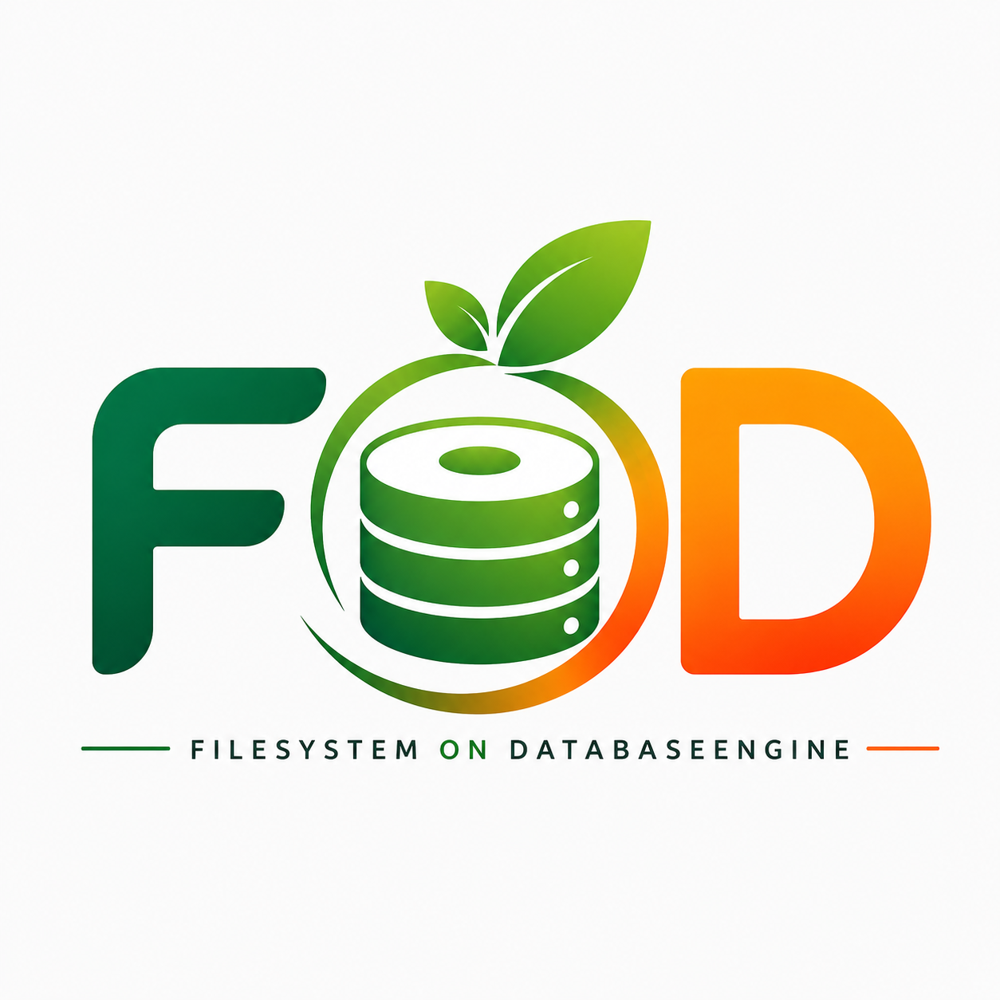

<p align="center">
  
</p>

# FOD

FOD (Filesystem On DataBaseEngine) is a PostgreSQL-backed filesystem exposed through FUSE. The runtime is implemented in Rust; PostgreSQL stores durable filesystem state while applications use normal Linux filesystem operations.

The authoritative project version is [`fod_version.txt`](fod_version.txt).

## What FOD provides

- Linux/FUSE file and directory semantics.
- PostgreSQL-backed durable metadata and payload storage.
- PostgreSQL-backed locking and session coordination for writable mounts.
- Primary/replica-aware PostgreSQL deployment support.
- Buffered writes, read cache, read-ahead and configurable admission controls.
- Docker deployment with one writable PostgreSQL primary, optional streaming replicas and one persistent FOD/FUSE client.
- Optional systemd integration for reboot recovery and non-disruptive FOD client upgrades.
- Rust tools for schema/bootstrap, monitoring and external-source indexing.

## Current architecture

| Layer | Current role |
| --- | --- |
| `rust_fuse` | FUSE frontend and filesystem callbacks |
| `rust_runtime` | PostgreSQL runtime, configuration and shared services |
| `rust_hotpath` | storage/read/write hot-path helpers |
| `rust_mkfs` | schema/bootstrap/configuration tools |
| `rust_monitor` | runtime and cluster diagnostics |
| `rust_indexer` | source registration, scan/hash/import tooling |
| PostgreSQL | durable metadata, payload, locks, sessions and replication |

The production Docker reference deployment uses PostgreSQL 16 with a 32 KiB server block size. This is independent of the FOD storage block size and FUSE request sizes.

For the exact current defaults and lifecycle guarantees, see [`docs/CURRENT_STATE.md`](docs/CURRENT_STATE.md).

## Documentation by task

Start with [`docs/README.md`](docs/README.md). It groups documentation by the job you want to perform rather than by historical implementation order.

| I want to... | Read |
| --- | --- |
| understand the current architecture/defaults | [`docs/CURRENT_STATE.md`](docs/CURRENT_STATE.md) |
| deploy PostgreSQL + FOD with Docker | [`docs/DOCKER_DEPLOYMENT.md`](docs/DOCKER_DEPLOYMENT.md) |
| operate or upgrade an installed deployment | [`docs/OPERATIONS.md`](docs/OPERATIONS.md) |
| manage only the FOD/FUSE container | [`docs/DOCKER_FOD_INSTALL.md`](docs/DOCKER_FOD_INSTALL.md) |
| configure persistent startup with systemd | [`docs/DOCKER_SYSTEMD.md`](docs/DOCKER_SYSTEMD.md) |
| configure runtime/mount behavior | [`docs/runtime-configuration.md`](docs/runtime-configuration.md) |
| verify PostgreSQL requirements | [`docs/POSTGRESQL_REQUIREMENTS.md`](docs/POSTGRESQL_REQUIREMENTS.md) |
| verify FUSE/kernel requirements | [`docs/FUSE_REQUIREMENTS.md`](docs/FUSE_REQUIREMENTS.md) |
| review security/permissions/host policy | [`docs/SECURITY.md`](docs/SECURITY.md) |
| profile or optimize performance | [`docs/performance.md`](docs/performance.md) |
| index/import external sources | [`docs/fod-indexer.md`](docs/fod-indexer.md) |
| develop FOD or change schema/contracts | [`docs/DEVELOPMENT.md`](docs/DEVELOPMENT.md) |
| inspect benchmark history | [`BENCHMARKS.md`](BENCHMARKS.md), [`docs/HISTORY.md`](docs/HISTORY.md) |
| inspect planned work | [`ROADMAP.md`](ROADMAP.md), [`TODO.md`](TODO.md) |
| follow validation procedures | [`zasady_sprawdzen.md`](zasady_sprawdzen.md) |

Versioned documents such as `docs/FOD_3_*` are historical implementation and measurement records. They remain useful evidence, but they are not the canonical source for current defaults. [`docs/HISTORY.md`](docs/HISTORY.md) maps that evidence by topic.

## Quick local development path

```bash
make up
make init
make smoke
make mount
```

In another shell:

```bash
make unmount
```

Main local regression gate:

```bash
make test-all
```

Broader mounted/indexer coverage:

```bash
make test-all-full
```

The repository intentionally has no active GitHub Actions workflow. Validation is performed through local Make/Cargo gates.

## Production-style Docker deployment

Supported reference topology:

```text
1 writable PostgreSQL primary
0..32 streaming PostgreSQL replicas
1 persistent FOD/FUSE client
```

`MASTERS>1` is rejected because the deployment does not implement safe PostgreSQL multi-primary election.

Typical installation:

```bash
make docker-deploy-plan MASTERS=1 SLAVES=2
make docker-deploy-fod-host-prepare MASTERS=1 SLAVES=2
make docker-deploy-install MASTERS=1 SLAVES=2
make docker-deploy-smoke MASTERS=1 SLAVES=2
```

Persistent host startup:

```bash
sudo make docker-deploy-systemd-install MASTERS=1 SLAVES=2
```

When the systemd service is already active, reinstall/upgrade uses reload and reconciliation instead of a full service restart. Updating the FOD client does not stop or recreate healthy PostgreSQL primary/replica containers. The explicit `docker-deploy-systemd-restart` target remains a full deployment restart.

See [`docs/OPERATIONS.md`](docs/OPERATIONS.md) for upgrade verification.

## Configuration and I/O sizing

Main examples:

- [`fod_config.ini`](fod_config.ini) - local development/test configuration,
- [`fod_config.example.ini`](fod_config.example.ini) - shareable template.

Important size layers are deliberately separate:

- FOD storage block: 4 KiB,
- FUSE max write request: 1 MiB by default,
- FUSE max readahead: 512 KiB by default,
- base persist chunk: 128 FOD blocks = 512 KiB,
- PostgreSQL block size in the production Docker image: 32 KiB.

Changing a FUSE request size does not change the FOD on-database storage block format.

## Main binaries

- `fod-bootstrap`
- `fod-config`
- `mkfs.fod`
- `mount.fod`
- `fod-monitor`
- `fod-indexer`

## Quality gates

Before committing a release change, at minimum keep version metadata and release policy tests green:

```bash
make test-cargo-lock-integrity
make test-version
make test-docker-deploy-policy
make test-docker-fod-install-policy
make test-docker-deploy-systemd-policy
make test-docker-fod-client-policy
```

Use the broader test profiles in [`zasady_sprawdzen.md`](zasady_sprawdzen.md) for runtime changes.

Every commit increments the patch version. See [`docs/versioning.md`](docs/versioning.md).

## Licensing

FOD is source-available software licensed under Business Source License 1.1.

- Non-commercial use is allowed.
- Commercial usage requires a separate written agreement with the copyright holder.
- See [`LICENSE`](LICENSE) and [`LICENSE-COMMERCIAL`](LICENSE-COMMERCIAL).
